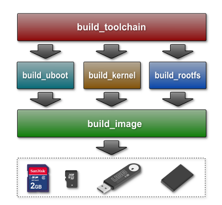

# Embedded Linux Tools

This directory contain a collection of scripts for creating ARM based Linux OS Image 




## Installation

For installing the emLinux Tools into your PC run following commands in shell window:

```bash
   $ git clone https://github.com/molejar/emLinux.git emLinux
   $ cd emLinux/tools
   $ sudo ./install
```

In Debian based distributions you can jump this step and instal directly the package `emlinux-tools_1.x-x_all.deb` 
from [vm/dpkg](../vm/dpkg) with command:

```bash
   $ dpkg -i emlinux-tools_1.x-x_all.deb
```

## Collection of Commands

All commands are still in alpha phase, there could exist some issues or not fully implemented functions.

* *build_toolchain* - Prepare toolchain for barebox, uboot and kernel building
* *build_barebox* - Build BareBox Bootloader (replacement of U-Boot) 
* *build_uboot* - Build U-Boot Bootloader from sources in git repo
* *build_kernel* - Build Kernel from sources in git repo
* *build_rootfs* - Build munimal RootFS based on Debian packages
* *build_image* - Create SD Card image from uboot, kernel and rootfs


### Build Toolchain

```bash
Usage: ./build_toolchain [options]

Toolchain build script for i.MX (NXP MPU)

OPTIONS:
   -h/--help   Show this message
   -x          Use XDialog
   -v          Verbose
```

### Build BareBox Bootloader

```bash
Usage: ./build_barebox [options] [params]

BareBox build script for i.MX (NXP MPU)
  - use "bpatch" dir for aplying new patches
  - use "bconf" dir for aplying own "config"

OPTIONS:
   -h/--help   Show this message
   -u/--updt   Update working branch from remote branch
   -c/--clean  Clean sources (remove all uncomited changes)
   -p/--patch  Create patch from working sources
   -m/--mcfg   Run menuconfig
   -x          Use XDialog
   -v          Verbose

PARAMS:
   -s/--surl   Set GitRepo URL for BareBox SRC (optional)
   -t/--btool  Set path for external toolchain (optional)
```

### Build U-Boot Bootloader

```bash
Usage: ./build_uboot [options] [params]

U-Boot build script for i.MX (NXP MPU)
   - use "mydata" dir for own data like patches, configs and sources

OPTIONS:
   -h/--help   Show this message
   -u/--updt   Clean sources and update local branch
   -c/--clean  Clean sources (remove all uncomited changes)
   -p/--patch  Create patch from working sources
   -m/--mcfg   Run menuconfig
   -x          Use XDialog
   -v          Verbose (print debug info)

PARAMS:
   -s/--surl   Set GitRepo URL for U-Boot SRC (optional)
   -t/--btool  Set path for external toolchain (optional)
```

### Build Linux Kernel

```bash
Usage: ./build_kernel [options] [params]

Linux Kernel build script for i.MX (NXP MPU)
   - use "mydata" dir for own patches, configs and sources

OPTIONS:
   -h/--help   Show this message
   -u/--updt   Clear sources and update local branch
   -c/--clean  Clean sources (remove all uncomited changes)
   -p/--patch  Create patch from working sources
   -z/--zip    Compress build data into zip archive 
   -m/--mcfg   Run menuconfig
   -f          Include firmwares
   -x          Use XDialog
   -v          Verbose (print debug info)

PARAMS:
   -i/--img    Set Image Type (Image, uImage or zImage <default>)
   -s/--surl   Set GitRepo URL for Linux SRC (optional)
   -t/--btool  Set path for external toolchain (optional)
   -a/--laddr  Set target LOADADDR as "0x........" (optional)
```

### Build RootFS from Debian or Ubuntu packages

```bash
Usage: ./build_rootfs [options]

RootFS creator script for i.MX (NXP MPU)
  - use "mydata" dir for aditional files

OPTIONS:
   -h/--help   Show this message
   -i          Create initial config
   -x          Use XDialog
   -v          Verbose
```

### Build SD Card Image

```bash
Usage: ./build_image [options]

SDCard image creator script for i.MX (NXP MPU)
  - use "uboot"  dir for bootloader image and env
  - use "kernel" dir for kernel image and *.dtb files
  - use "rootfs" dir for rootfs pkgs or rawdata

OPTIONS:
   -h/--help   Show this message
   -i/--init   Create required dirs and exit
   -e/--extr   Extract SD Card Image <path to image>
   -s/--sfatp  Set FAT16 partition size in MB (default: 20)
   -f/--sfree  Set RootFS free space in MB (default: 200)
   -c          Comress SD image: zip or gzip (default: zip)
   -x          Use XDialog
   -v          Verbose
```

## Usefull Links

* [Debian Quality Assurance](https://piuparts.debian.org)
